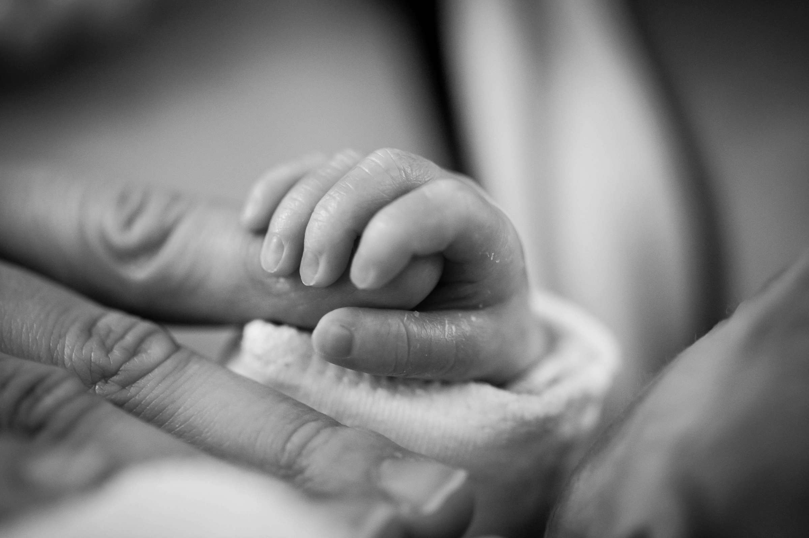

## Bio

<!-- [¡Read this en español!](./es) -->

I am a new birth doula excited to be serving the greater Boston area! I recently completed a DONA doula training course and am working towards fulfilling the remaining DONA certification requirements. Since I am a new doula, I am currently offering my services for **FREE**.

- DONA trained, working towards certification
- Bilingual English/Spanish
- Offering free birth doula services
- Fully up-to-date on COVID vaccines
- B.A. Tufts University

### My Service

I offer two prenatal appointments (approximately 2 hours each), support during labor, and one post-natal appointment, plus continuous text and call availability. No cost while I work towards DONA certification.

I am currently seeking clients with due date (40 weeks) on or before May 5, due to limits on my availability at the very end of May. I want to be sure that if you go past your due date, I'll still be around to support you!

### What is a birth doula?

Birth doulas offer professional, non-medical support to birthing people during their labor experience, and in other parts of the perinatal period. What a doula does for you is dependent on YOU and what you are looking for. We can help you advocate for yourself to medical staff if you ever feel rushed into making a decision about your health. We can support you with massage or maintaining your breathing rhythm while in labor. We can encourage your partner or another family member or friend in the delivery room when they are feeling overwhelmed by the experience. And we can stay with you, listening and responding to your needs for hours while you are in labor. To find out more about doulas, check out: [What is a Doula?](https://www.dona.org/what-is-a-doula/)

### My Path as a Doula

I received my B.A. from Tufts University in 2019, with a double major in biology and international relations. After graduating, I became interested in pursuing a career in healthcare and have since been working in public health research at Massachusetts General Hospital. This job allowed me to conduct one-on-one interviews in both English and Spanish with a huge range of amazing people who were receiving care at Mass General Brigham. The experience fortified my interest in learning about the unique story of each person with whom I spoke. Though I was working on great research that will help patients at Mass General Brigham in the future, I found myself wanting to connect with the people with whom I was working more deeply and to directly serve them through the difficult health situations that they described, rather than just collecting data for research.

I realized that becoming a doula would help me combine this drive for human connection and being of service to others with my interest in reproductive health. This interest began due to my personal experience with endometriosis. When I was encountering intense pain and confusing health symptoms, I often felt brushed aside or ignored by healthcare providers. Even doctors who were great listeners only had a 7-minute visit to try to get to know me and learn everything they could! Through these personal experiences, I learned how to advocate for myself in medical settings and navigate a health system that often felt impersonal, rushed, and frustrating. I know that many pregnant and birthing people experience obstacles and disappointments which are similar to those that I’ve gone through. As a doula, I will be able to form close relationships with my clients, share their joy in happy moments, and help them advocate for themselves at times when they are in pain, frustrated, or anxious.
